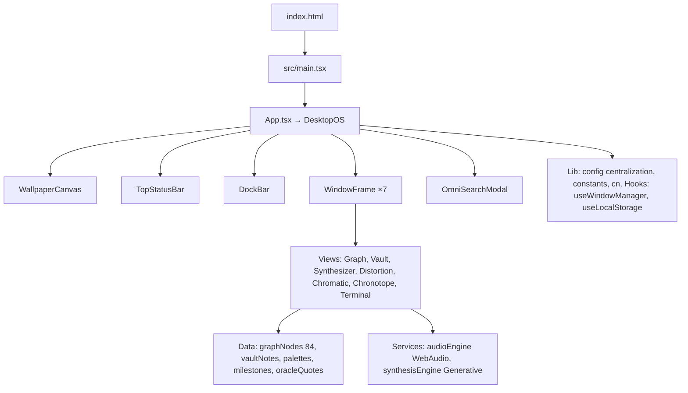

# NOOSPHERE-OS v9.4 — Polymathic Cognitive Engine & Visionary Vault

[](https://github.com/zazieproductions/NOOSPHERE-OS-v9.4-Polymathic-Cognitive-Engine-Visionary-Vault/actions/workflows/ci.yml)
[](https://www.typescriptlang.org/)
[](https://react.dev/)
[](https://vitejs.dev/)
[](https://tailwindcss.com/)
[](./LICENSE)
[](#testing)

> A desktop-OS simulation for **polymathic synthesis** — collide esoteric knowledge graphs, generate high-entropy marketing theses, and augment cognition with binaural audio and generative wallpapers.

**Live Demo**: `npm run dev` → http://localhost:5173

---

## Why It Exists

Modern growth tools are commoditized: same funnels, same copy, same aesthetics. NOOSPHERE-OS is a **counter-tool** that weaponizes deep research — Deleuze's rhizome, Baudrillard's simulacra, Girard's mimetic desire, Shannon entropy, mycelial networks, cybernetic homeostasis — to produce **reality-distorting narratives** that command attention in saturated markets.

It's simultaneously:

- **Software** — functional OS shell with windowing, canvas wallpapers, WebAudio, generative engines
- **Creative-technology portfolio artifact** — demonstrates bridging research, generative systems, audiovisual engineering, and product thinking
- **Visionary vault** — 84+ polymathic concepts, markdown notes with backlinks, chromatic labs, campaign chronotopes

## What It Does — Key Capabilities

### 🖥️ Desktop OS Simulation
- Draggable, resizable, z-index stacking windows with glassmorphism chrome
- Top status bar with live telemetry, wallpaper selector, workspace presets (Grand Matrix, Deep Graph, Synthesis Studio, Zen Reader, Command Deck)
- Dock bar with window toggles and global Eureka trigger
- Cmd+K omnibox: search nodes, notes, palettes, commands, toggle binaural

### 🕸️ Neural Graph — 84+ Synaptic Concepts
- 9 categories: semiotics, hypergrowth, cybernetics, biomimicry, avant-garde, quantum, memetics, ai-orchestration, esoteric
- Force-ish layout, category colors, connection lines, stats overlay (Active Nodes / Synapses / Entropy)
- Add new nodes, filter by category, focus, collide into synthesizer, open vault notes

### 📚 Vault Notes — Epistemic Archives
- Markdown notes with cognitive density (1-100), read time, tags, backlinks, relatedNodeId
- Pin/favorite, edit/preview, copy markdown, export .md
- Density visualization, category badges

### ⚗️ Idea Collider — Polymath Synthesis Reactor
- Select 1-4 nodes, adjust entropy temperature (0.1-1.0)
- Presets: Hyperstition Drop, Mycelial Virality, Quantum Entropy
- Generates: codename, thesis, semiotic deconstruction, GTM vector, psychographic, virality index (72-99), hex palette, tweet storm, manifesto, AI prompt recipe, friction rating
- Confetti + Solfeggio eureka chord on synthesis

### 🌀 Reality Distortion Field & LARP Simulator
- Jargon alchemizer: converts "leads", "ad", "landing", "viral", "pricing" into esoteric prose + framework + axiom
- Fallback generator for arbitrary input: "By deconstructing X through lens of Y..."
- Steve Jobs prescience matrix vibe

### 🎨 Hex Chromatic Lab — Retinal Dominance
- OLED-optimized palettes with psychographic roles, contrast scores, audience recommendations
- Vibe, archetype, color roles

### ⏳ The Chronotope — Hyperstition Campaign Matrix
- Campaign milestones with phase, codename, timeframe, objective, semiotic payload, virality target, status, KPIs

### 💻 synapse-cli Terminal
- Commands: `help`, `stats`, `eureka`, `quote` (polymath oracle), `binaural` (toggle 6Hz theta), `scan-noosphere`, `matrix`, `clear`
- Synaptic click sounds on typing

### 🔊 Polymath Audio Engine — Web Audio API
- Synaptic clicks (40ms sine decay), node blips (90ms triangle rise), eureka chords (5-note Solfeggio 528Hz harmonic series)
- Binaural theta: 216Hz carrier + 6Hz beat, stereo panned, gentle fade
- Lazy AudioContext, master gain mute, graceful degradation, dispose()

### 🌌 WallpaperCanvas — 5 Generative Modes
- **Neural**: 60 particles, velocity, connection lines, mouse parallax
- **Matrix Rain**: Phosphor green cascading katakana + binary
- **Cyber Grid**: Isometric perspective grid with vanishing point
- **Topological**: Morphing iso-contours & strange attractors
- **Deep Void**: Minimal stardust meditation
- Single canvas, RAF loop, resize + mousemove listeners, cleanup on unmount

## Architecture



See [docs/architecture.md](./docs/architecture.md) for deep dive, and [docs/](./docs/) for data model, audio, synthesis, wallpaper, development, creative methodology, roadmap.

## Quick Start

```bash
git clone https://github.com/zazieproductions/NOOSPHERE-OS-v9.4-Polymathic-Cognitive-Engine-Visionary-Vault.git
cd NOOSPHERE-OS-v9.4-Polymathic-Cognitive-Engine-Visionary-Vault
npm install
npm run dev
# → http://localhost:5173
```

## Installation

**Requirements**: Node >=18, npm >=9

```bash
npm ci          # clean install (CI)
npm install     # local dev
```

## Usage

### Development

```bash
npm run dev          # Vite dev server, HMR, host 0.0.0.0:5173
npm run preview      # Preview production build on 4173
```

### Core Interactions

- **Drag** window via title bar, **resize** via bottom-right handle
- **Focus** window by clicking, **minimize** via dock or title bar, **maximize** via square icon
- **Presets**: Top bar → Presets → Grand Matrix / Deep Graph / Synthesis Studio / Zen Reader / Command Deck
- **Wallpaper**: Top bar → Wallpaper → Neural / Matrix Rain / Cyber Grid / Topological / Deep Void
- **Search**: Cmd+K / Ctrl+K → search nodes, notes, palettes, trigger eureka, toggle binaural
- **Graph**: Click node → details panel → Collide Concept (→ synthesizer) or Open Note Vault
- **Synthesizer**: Select 1-4 nodes → adjust temperature → Synthesize → copy sections
- **Terminal**: Type `help`, `eureka`, `quote`, `binaural`, `scan-noosphere`, `matrix`

### Building

```bash
npm run build    # tsc -b && vite build → dist/
npm run preview  # serve dist/
```

## Configuration

Centralized in `src/lib/config.ts`, reads `VITE_` env vars:

| Var | Default | Purpose |
|-----|---------|---------|
| `VITE_AUDIO_ENABLED` | true | Enable WebAudio |
| `VITE_CONFETTI_ENABLED` | true | Confetti on eureka |
| `VITE_BINAURAL_DEFAULT` | false | Auto-start binaural |
| `VITE_WALLPAPER_MODE` | neural | Default wallpaper |
| `VITE_WALLPAPER_PARALLAX` | true | Mouse parallax |

Create `.env.local` (gitignored) for local overrides:

```ini
VITE_WALLPAPER_MODE=topological
VITE_BINAURAL_DEFAULT=true
```

## Project Structure

```
.
├── public/
│   └── favicon.svg
├── src/
│   ├── main.tsx
│   ├── App.tsx
│   ├── styles/
│   │   ├── globals.css       # Tailwind + glassmorphism tokens
│   │   └── index.css         # Legacy re-export
│   ├── lib/
│   │   ├── cn.ts
│   │   ├── config.ts         # Env centralization
│   │   └── constants.ts      # Window titles, audio, graph constants
│   ├── hooks/
│   │   ├── useWindowManager.ts
│   │   ├── useLocalStorage.ts
│   │   └── useKeydown.ts
│   ├── types/
│   │   └── index.ts
│   ├── data/
│   │   ├── graphNodes.ts     # 84 nodes + CATEGORY_COLORS
│   │   ├── vaultNotes.ts
│   │   ├── palettes.ts
│   │   ├── campaignMilestones.ts
│   │   └── oracleQuotes.ts
│   ├── services/
│   │   ├── audioEngine.ts    # WebAudio
│   │   └── synthesisEngine.ts# Concept collider
│   └── components/
│       ├── os/
│       │   ├── DesktopOS.tsx
│       │   ├── WindowFrame.tsx
│       │   ├── DockBar.tsx
│       │   ├── TopStatusBar.tsx
│       │   ├── WallpaperCanvas.tsx
│       │   └── OmniSearchModal.tsx
│       ├── views/
│       │   ├── NeuralGraphView.tsx
│       │   ├── VaultNotesView.tsx
│       │   ├── IdeaSynthesizerView.tsx
│       │   ├── RealityDistortionView.tsx
│       │   ├── HexChromaticLab.tsx
│       │   ├── ChronotopeTimelineView.tsx
│       │   └── TerminalView.tsx
│       └── ui/
│           ├── Button.tsx
│           ├── Badge.tsx
│           └── Panel.tsx
├── tests/
│   ├── setup.ts
│   ├── synthesisEngine.test.ts
│   ├── audioEngine.test.ts
│   ├── types.test.ts
│   └── constants.test.ts
├── docs/
│   ├── architecture.md
│   ├── data-model.md
│   ├── audio-engine.md
│   ├── synthesis-engine.md
│   ├── wallpaper-system.md
│   ├── development.md
│   ├── creative-methodology.md
│   └── roadmap.md
├── .github/
│   └── workflows/
│       └── ci.yml
├── index.html
├── vite.config.ts
├── tsconfig.json
├── eslint.config.js
├── .prettierrc
├── .editorconfig
└── package.json
```

## Development

### Scripts

| Script | Purpose |
|--------|---------|
| `dev` | Vite dev server |
| `build` | Production build |
| `preview` | Preview build |
| `lint` | ESLint (warnings allowed) |
| `lint:strict` | ESLint max-warnings 0 |
| `lint:fix` | Auto-fix |
| `format` | Prettier write |
| `format:check` | Prettier check |
| `typecheck` | tsc --noEmit |
| `test` | Vitest run |
| `test:watch` | Vitest watch |
| `test:coverage` | Coverage |
| `validate` | typecheck + lint + test + build |

### Conventions

- **TypeScript strict**, no implicit any, types in `src/types/`
- **Components**: `os/` for shell, `views/` for domain, `ui/` for primitives
- **State**: Cross-window in `DesktopOS`, local via `useState`, persistence via `useLocalStorage` (future)
- **Data**: Static const in `src/data/`, never mutate — clone first
- **Services**: Side effects in `src/services/` with error boundaries
- **Styling**: Tailwind v4 + custom CSS tokens, `cn()` utility
- **Commits**: Conventional commits (`feat:`, `fix:`, `docs:`, `refactor:`)

See [docs/development.md](./docs/development.md) for full guide and [CONTRIBUTING.md](./CONTRIBUTING.md) for contribution flow.

## Testing

```bash
npm run test          # run once
npm run test:watch    # watch mode
npm run test:coverage # coverage
```

- **Vitest** + jsdom + @testing-library
- `tests/setup.ts` mocks canvas, AudioContext, confetti, ResizeObserver, matchMedia
- 23 tests: synthesis engine (validation, virality, jargon), audio engine (mute, binaural), types, constants
- For canvas/WebAudio, mock aggressively — don't test browser APIs

## Troubleshooting

| Issue | Fix |
|-------|-----|
| AudioContext suspended | Click anywhere — `initContext()` resumes on gesture |
| Canvas blank | Check wallpaper mode, ensure window size >0, check console |
| Window off-screen | Resize viewport or apply preset via TopStatusBar → Presets |
| Build chunk warning | Increase `chunkSizeWarningLimit` or code-split views with `React.lazy` |
| Tests fail AudioContext | Ensure `tests/setup.ts` mocks AudioContext, check `vite.config.ts` test.include |
| Lint too many warnings | `npm run lint` allows warnings, `lint:strict` enforces 0 |

More in [docs/development.md](./docs/development.md).

## Roadmap

### ✅ Implemented (v9.4)
- OS shell, 7 views, 5 wallpapers, omnibox, audio engine, synthesis engine, 84 nodes, CI, tests, docs

### 🧪 Experimental / Partial
- Force simulation simplified, 3D toggle placeholder, vault category filter unused, AudioLab/Settings/Oracle windows registered but no views

### 🔮 Future
- Persist layout to localStorage, fuzzy search with fuse.js, export PDF/Notion, shareable seed URLs, plugin system, Web Worker force sim, WebGL shaders, PWA, multiplayer cursors, 20 more nodes

See [docs/roadmap.md](./docs/roadmap.md) for detailed breakdown.

## Contributing

We welcome contributions that improve engineering quality **and** preserve creative weirdness.

1. Fork & clone
2. `npm install`
3. `npm run dev`
4. Make changes, add tests if applicable
5. `npm run validate`
6. Open PR with clear description

See [CONTRIBUTING.md](./CONTRIBUTING.md).

## License

MIT © 2026 NOOSPHERE-OS Contributors — see [LICENSE](./LICENSE).

## Acknowledgments

- **Fonts**: JetBrains Mono, Syne, Space Grotesk, Cinzel, Plus Jakarta Sans via Google Fonts
- **Icons**: [lucide-react](https://lucide.dev/)
- **Animation**: [framer-motion](https://www.framer.com/motion/), [canvas-confetti](https://github.com/catdad/canvas-confetti)
- **Build**: [Vite](https://vitejs.dev/), [Tailwind CSS v4](https://tailwindcss.com/)
- **Inspiration**: Deleuze & Guattari, Baudrillard, Girard, Debord, McLuhan, Wiener, Shannon, CCRU, Steve Jobs reality distortion

---

**NOOSPHERE-OS v9.4** — *When you price at the 99th percentile and disqualify 94% of applicants, the purchase ceases to be a commercial exchange and becomes an alchemical transformation.*
