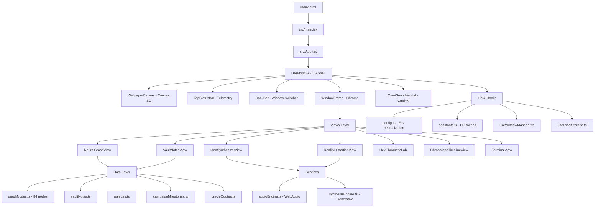
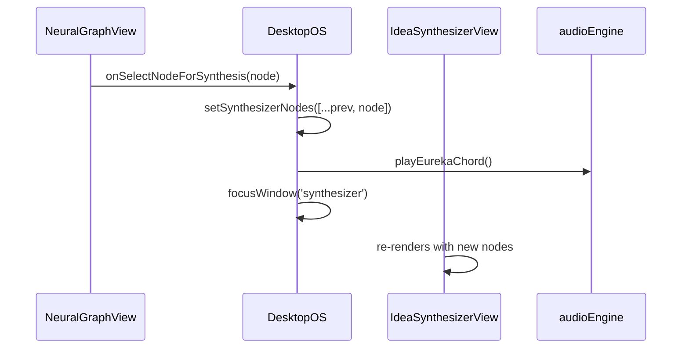

# Architecture Overview

NOOSPHERE-OS is a **client-side React SPA** that simulates a desktop operating system for polymathic knowledge synthesis. No backend — all logic runs in-browser.

## High-Level System



## Folder Structure

```
src/
├── main.tsx                 # Entry, mounts App
├── App.tsx                  # Root, renders DesktopOS
├── styles/
│   ├── globals.css          # Tailwind + custom tokens
│   └── index.css            # Legacy re-export
├── lib/
│   ├── cn.ts                # ClassName utility
│   ├── config.ts            # Env & feature flags
│   └── constants.ts         # Window titles, audio, graph constants
├── hooks/
│   ├── useWindowManager.ts  # Extracted window logic
│   ├── useLocalStorage.ts   # Persistent state
│   └── useKeydown.ts        # Global shortcuts
├── types/
│   └── index.ts             # Core domain types
├── data/
│   ├── graphNodes.ts        # 84+ polymathic concepts + category colors
│   ├── vaultNotes.ts        # Markdown notes with backlinks
│   ├── palettes.ts          # Chromatic lab palettes
│   ├── campaignMilestones.ts
│   └── oracleQuotes.ts
├── services/
│   ├── audioEngine.ts       # WebAudio: binaural, clicks, eureka
│   └── synthesisEngine.ts   # Concept collider & jargon alchemizer
└── components/
    ├── os/                  # OS shell
    │   ├── DesktopOS.tsx    # Main orchestrator, window registry, presets
    │   ├── WindowFrame.tsx  # Draggable, resizable, z-index
    │   ├── DockBar.tsx
    │   ├── TopStatusBar.tsx
    │   ├── WallpaperCanvas.tsx
    │   └── OmniSearchModal.tsx
    ├── views/               # Domain views (one per window)
    │   ├── NeuralGraphView.tsx
    │   ├── VaultNotesView.tsx
    │   ├── IdeaSynthesizerView.tsx
    │   ├── RealityDistortionView.tsx
    │   ├── HexChromaticLab.tsx
    │   ├── ChronotopeTimelineView.tsx
    │   └── TerminalView.tsx
    └── ui/                  # Shared primitives
        ├── Button.tsx
        ├── Badge.tsx
        └── Panel.tsx
```

## Window Management

`DesktopOS` owns all window state:

- `windows: Record<WindowId, WindowState>` — position, size, zIndex, open/minimized/maximized
- `topZIndex` — monotonically increasing for focus
- `focusWindow(id)` — brings to front, opens if closed
- `toggleWindow(id)` — dock behavior: open → minimize → restore
- `applyPreset(preset)` — workspace layouts (grandMatrix, deepGraph, etc.)

`WindowFrame` handles drag & resize via mouse events, clamped to viewport, with audio feedback.

`useWindowManager` hook extracts this logic for testability (future).

## Data Flow — Cross-Window

Example: Selecting a node in Graph → Synthesizer:



Vault notes similarly sync via `activeVaultNoteId`.

## Rendering Strategy

- **Canvas**: WallpaperCanvas uses single `<canvas>` with `requestAnimationFrame`, mouse parallax via `mousemove` listener. No React re-renders per frame — pure imperative.
- **Graph**: NeuralGraphView uses canvas or SVG? Currently div-based with force simulation (simplified). Nodes positioned via `x,y` from data or force layout.
- **Rest**: Tailwind + React, glassmorphism via CSS backdrop-filter.

## Performance Considerations

- WallpaperCanvas: 5 modes, each with own render loop. Cleans up on unmount / mode change.
- AudioEngine: Lazy AudioContext, avoids autoplay violations.
- Confetti: canvas-confetti only on eureka, gated by config.
- Build: Vite code-splitting, sourcemaps enabled, chunk warning 1000kB.

## Security & Env

- No secrets in client. `config.ts` centralizes `VITE_` env vars.
- `index.html` has no inline scripts except module entry.
- All external fonts via Google Fonts preconnect.

## Future Architecture Ideas

- Extract force simulation to Web Worker
- Persist window layout to localStorage
- Add command palette fuzzy search with `fuse.js`
- Plugin system for new views
