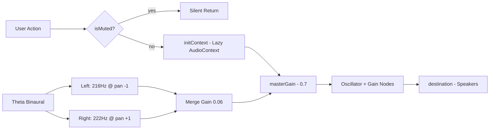

# Audio Engine — Web Audio API Polymath Sound Engine

File: `src/services/audioEngine.ts`

## Purpose

Audiovisual cognitive augmentation: subtle UI feedback + binaural brainwave entrainment for deep work.

## Features

| Sound | Method | Description |
|-------|--------|-------------|
| Synaptic Click | `playSynapticClick(freq, type)` | 40ms sine decay, 1200Hz default, for button presses, window drag |
| Node Blip | `playNodeBlip(freq)` | 90ms triangle rise, 640Hz default, for graph node focus |
| Eureka Chord | `playEurekaChord()` | 5-note Solfeggio harmonic series (528, 660, 792, 1056, 1320 Hz) with staggered attack, 1.9s decay |
| Theta Binaural | `startThetaBinaural()` / `toggleThetaBinaural()` | 216Hz carrier + 6Hz beat, stereo panned, gentle 2s fade-in, 0.8s fade-out |

## Architecture



- **Lazy init**: AudioContext created on first sound, resumes if suspended (autoplay policy)
- **Master gain**: Global mute via `setMuted(bool)` sets gain to 0 or 0.7
- **Graceful degradation**: Try/catch everywhere, warns but never throws to UI
- **Cleanup**: `stopThetaBinaural` fades out then stops/disconnects nodes after 850ms; `dispose()` closes context

## Constants (src/lib/constants.ts)

```ts
AUDIO = {
  BINAURAL_CARRIER: 216, // Sacred tuning
  BINAURAL_BEAT: 6.0,    // Theta brainwave
  MASTER_GAIN: 0.7,
  CLICK_DURATION: 0.04,
  BLIP_DURATION: 0.09,
}
```

## Usage Examples

```ts
import { audioEngine } from '../services/audioEngine';

// UI feedback
audioEngine.playSynapticClick(900);
audioEngine.playNodeBlip(950);

// Eureka moment
audioEngine.playEurekaChord();

// Binaural toggle (e.g. in TopStatusBar or Terminal)
const isActive = audioEngine.toggleThetaBinaural();

// Mute (e.g. settings)
audioEngine.setMuted(true);
```

## Browser Compatibility

- Uses `window.AudioContext || webkitAudioContext`
- Checks `createStereoPanner` existence, falls back to mono merge if missing
- Canvas-confetti gated by `config.features.confettiEnabled`

## Future Ideas

- Add more soundscapes: cybernetic drone, data stream
- Visualize audio with AnalyserNode → canvas
- Persist mute/binaural state to localStorage
- Web Worker for audio scheduling
