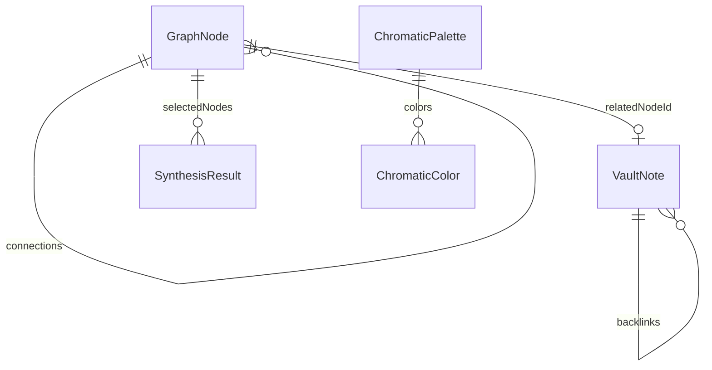

# Data Model

## Core Types (src/types/index.ts)

### Window System

```ts
type WindowId = 'graph' | 'vault' | 'synthesizer' | 'distortion' | 'chromatic' | 'chronotope' | 'terminal' | 'oracle' | 'audioLab' | 'settings';

interface WindowState {
  id: WindowId;
  title: string;
  subtitle?: string;
  icon: string; // Lucide name
  isOpen: boolean;
  isMinimized: boolean;
  isMaximized: boolean;
  position: { x, y };
  size: { width, height };
  zIndex: number;
  badge?: string;
}
```

### GraphNode

84 nodes across 9 categories:

- `semiotics` — Deleuze, Baudrillard, Girard, Debord, McLuhan
- `hypergrowth` — Hook velocity, CAC/LTV singularity, epistemic arbitrage, hyperstition, dopamine lattice
- `cybernetics` — Wiener homeostasis, Ashby requisite variety, Shannon entropy, etc.
- `biomimicry`, `avantgarde`, `quantum`, `memetics`, `ai-orchestration`, `esoteric`

```ts
interface GraphNode {
  id: string;
  label: string;
  category: NodeCategory;
  summary: string;
  epistemicContext: string;
  cognitiveWeight: 1-10;
  tags: string[];
  connections: string[]; // other node IDs
  hexColor: string;
  x?, y?, vx?, vy?, fx?, fy? // force sim
  quote?: string;
  applicationVector?: string; // GTM tactic
}
```

Connections form a directed (but treated as undirected) graph. `CATEGORY_COLORS` maps category → bg/border/text/glow.

### VaultNote

Markdown-like notes with backlinks:

```ts
interface VaultNote {
  id: string;
  title: string;
  category: NodeCategory;
  cognitiveDensity: 1-100;
  readTime: string;
  tags: string[];
  dateCreated: string;
  excerpt: string;
  content: string; // full markdown
  backlinks: string[];
  relatedNodeId?: string; // links to GraphNode
  isPinned?, isFavorite?;
}
```

### SynthesisResult

Output of `synthesizeConcepts(nodes, temperature)`:

- `codename` — e.g. "OPERATION NOOSPHERE-VANGUARD // v3.2"
- `thesis` — 1-paragraph core argument
- `semioticDeconstruction` — why legacy framing fails
- `gtmVector` — 3-phase GTM
- `targetPsychographic` — who it's for
- `viralityIndex` 72-99
- `hexPalette` — 5 colors
- `tweetStorm` — 4 tweets
- `provocativeManifesto`
- `aiPromptRecipe`
- `marketFrictionRating`

### ChromaticPalette

For HexChromaticLab:

```ts
interface ChromaticPalette {
  id, name, vibe, description, archetype;
  colors: { hex, name, role, psychographic }[];
  contrastScore, recommendedAudience;
}
```

### OracleQuote & CampaignMilestone

- Oracle: quote + polymath + era + axiom + tactical relevance
- Milestone: phase, title, codename, timeframe, objective, semioticPayload, viralityTarget, status, kpis, tags

## Data Files

| File | Count | Purpose |
|------|-------|---------|
| `graphNodes.ts` | 84 | Knowledge graph |
| `vaultNotes.ts` | ~20 | Epistemic archives |
| `palettes.ts` | 6-8 | Color systems |
| `campaignMilestones.ts` | 6-8 | Chronotope timeline |
| `oracleQuotes.ts` | 10-15 | Terminal `quote` command |

## Relationships



## Validation

- `synthesizeConcepts` validates 1-4 nodes, throws otherwise
- `cognitiveWeight` clamped 1-10, `cognitiveDensity` 1-100, `viralityIndex` 72-99
- No runtime mutation of exported constants — clone before editing (enforced by convention)
